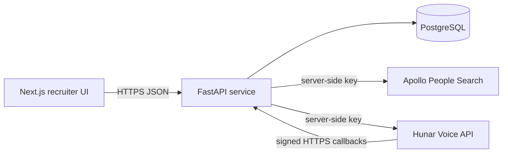

# Architecture

## System shape

The UI never receives provider credentials. The API owns normalization, authorization gates for live calls, raw response retention, callback verification, and idempotent persistence.

## Provider boundaries

`PeopleSearchProvider` and `VoiceProvider` are deliberately small contracts. Real and demo implementations share each interface, so the public reviewer journey behaves consistently without implying that seeded records are live.

## Data model

- `Role` owns `ScreeningQuestion` records.
- `CandidateRole` models pipeline stage and transparent match reasons.
- `SearchRun` records provider, filters, demo status, and raw response.
- `Campaign` owns candidate `Call` records.
- `StructuredAnswer`, `Transcript`, and `RecruiterReview` preserve distinct sources.
- `WebhookEvent` is the idempotency ledger.
- `ActivityEvent` supports recruiter-facing recent activity.

## Decision provenance

Provider results, application-generated summaries, and human decisions are stored and displayed separately. Automated recommendations remain advisory and can be overridden with a reason.

## Deployment shape

The frontend can be deployed to a modern edge host. The FastAPI container can run on Render, Railway, Fly.io, or a similar Python host backed by managed PostgreSQL. Live Hunar callbacks require the backend to expose a stable public HTTPS URL.
